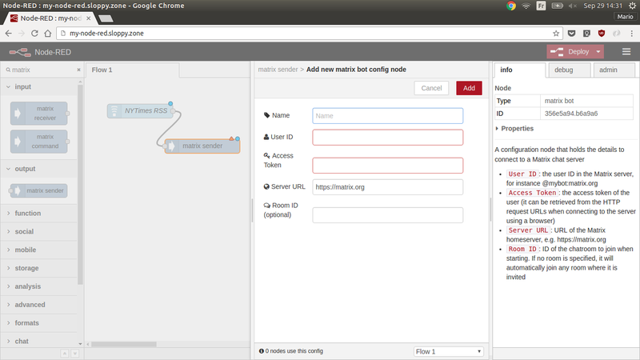

# Visual bot creation using Node-RED

It's very easy to create simple interactions with a [Matrix](https://matrix.org) chatroom without programming. Discover [Node-RED](http://nodered.org/), a visual tool to wire together APIs. We have extended Node-RED with nodes to listen and talk in Matrix chatrooms.


## How to install Node-RED

Node-RED is an open-source web application that is easy to deploy as a Docker container. You can deploy it locally on your computer using Docker. Or you can use any of the available online Docker hosting offers, such as [sloppy.io](https://sloppy.io/) or [hyper_](https://hyper.sh/).

The custom Docker image which includes Node-RED plus additional nodes is available on our [DockerHub repository](https://hub.docker.com/r/maski/node-red-docker/)

### Install Node-RED on your local machine

First, [install Docker](http://www.docker.com/products/docker) if you haven't done it yet.

Then you just need to run:

        docker run -it -p 1880:1880 --name mynodered maski/node-red-docker

Let's dissect that command...

        docker run      - run this container... and build locally if necessary first.
        -it             - attach a terminal session so we can see what is going on
        -p 1880:1880    - connect local port 1880 to the exposed internal port 1880
        --name mynodered - give this machine a friendly local name
        maski/node-red-docker - the image to base it on


Running that command should give a terminal window with a running instance of Node-RED

        Welcome to Node-RED
        ===================
        8 Apr 12:13:44 - [info] Node-RED version: v0.14.5
        8 Apr 12:13:44 - [info] Node.js  version: v4.4.7
        .... etc

You can then browse to `http://{host-ip}:1880` to get the familiar Node-RED desktop.


### Install Node-RED on an online Docker hosting

A quick and easy way to host it online is to use Sloppy.io's 1-month free trial. 
Once you have created an account, go to the Dashboard and create a new project, a new service inside it, and an app within it using `maski/node-red-docker` as image path and pick a domain URI, such as `my-node-red.sloppy.zone`. Deploy the project, and you will have your own Node-RED server up and running at the selected URI.

## How to use Node-RED

You can learn how to use Node-RED by following the [Node-RED getting started guide](http://nodered.org/docs/getting-started/first-flow). You can find additional tutorials [here](http://noderedguide.com/).

## How to use the Matrix nodes in Node-RED

The package `node-red-contrib-matrixbot`, included in the abovementioned Docker image, adds 3 node types to the Node-RED palette (Matrix section, at the bottom):
* *Matrix sender*: sends messages from your Node-RED flow to the chatroom
* *Matrix receiver*: listens to messages in a chatroom and sends them to your Node-RED flow
* *Matrix command*: listens only to messages starting with a specific command and sends them to your Node-RED flow

All of these nodes require a Matrix Configuration with the following settings:

* *User ID*: the user ID in the matrix server, for instance @mybot:matrix.org
* *Access token*: the access token of the user in the matrix server
* *Server URL*: URL of the Matrix homeserver, e.g. https://matrix.org
* *Room ID*: ID of the chatroom to join when starting. If no room is specified, it will automatically join any room where it is invited

## A simple application

We will create a simple application that will send messages to a chatroom whenever a RSS feed gets updated:

* First, invite the bot to the chatroom where it will be speaking and note the room ID.
* In Node-RED, pick the *Feedparse* node from the palette (you can filter by typing the first letters at the top) and drop it on the canvas
* Double-click on it to configure it and then enter a RSS feed, for instance `http://rss.nytimes.com/services/xml/rss/nyt/World.xml`. Give the node a name if you want and then click *Done*.
* Pick the *Matrix sender* node and drop it on the canvas. Link the output of the previous node to its input.
* Now double click on it and click on the pencil next to *Connection* to configure the Matrix settings. Follow the instructions described in the previous section.
* Once you're done, click the *Deploy* button at the top right corner and you're done!
* If you want to show also the link in the resulting message, try adding a *function* node in the middle with the following code:
```
var title = msg.article.title;
var link = msg.topic;
msg.payload = title + " \n" + link;
return msg;
```



